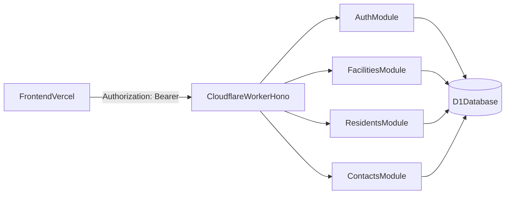

# Cloudflare Worker backend design (Bloque 3)

> **Estado actual:** diseño inicial de migración desde Render. Producción app médica: [medical-app-roadmap.md](./medical-app-roadmap.md). Baja de Render: [render-shutdown-checklist.md](./render-shutdown-checklist.md).

## Objetivo y alcance de este documento

Definir la arquitectura minima del nuevo backend en Cloudflare para iniciar la migracion desde Render de forma controlada.

Alcance de Bloque 3:
- Solo documentacion y diseno.
- Sin crear Worker aun.
- Sin crear migraciones D1 aun.
- Sin modificar frontend.
- Sin modificar backend actual en FastAPI.
- Sin tocar Render ni Vercel.

## Decision arquitectonica clave

No se va a portar FastAPI directamente a Cloudflare Workers.

El nuevo backend sera una implementacion nueva en `TypeScript + Hono + D1`, manteniendo compatibilidad con el frontend actual en:
- rutas HTTP
- payloads de request
- estructura de respuestas
- codigos de error esperados en los flujos principales

Esto reduce acoplamientos a SQLAlchemy/PostgreSQL y evita trasladar deuda tecnica de tipos y dependencias no portables.

## Estructura propuesta dentro del repo (solo diseno)

Carpeta propuesta para el nuevo backend:
- `cloudflare-worker/` (recomendada)

Alternativa valida:
- `backend-worker/`

Estructura logica recomendada:

```text
cloudflare-worker/
  src/
    index.ts
    app.ts
    config/
      env.ts
    middleware/
      auth.ts
      cors.ts
      errors.ts
    modules/
      auth/
        routes.ts
        service.ts
        repository.ts
        schemas.ts
      facilities/
        routes.ts
        service.ts
        repository.ts
        schemas.ts
      residents/
        routes.ts
        service.ts
        repository.ts
        schemas.ts
      contacts/
        routes.ts
        service.ts
        repository.ts
        schemas.ts
    db/
      client.ts
      helpers.ts
    shared/
      http.ts
      types.ts
      validators.ts
  tests/
    contract/
    integration/
  docs/
    decisions/
```

Nota: esta estructura es una guia de arquitectura. En este bloque no se debe crear la carpeta real ni archivos.

## Stack recomendado

- Runtime: Cloudflare Workers
- Framework HTTP: Hono
- Lenguaje: TypeScript
- Base de datos: Cloudflare D1 (SQLite)
- Auth: JWT HS256 compatible con frontend actual
- Password hashing en Workers:
  - opcion recomendada para MVP: `bcryptjs` (compatibilidad simple y rapida)
  - alternativa evaluable: `scrypt` con Web Crypto si se busca endurecimiento adicional

## Endpoints de Fase 1 (compatibilidad con frontend actual)

Objetivo de Fase 1: cubrir `auth + facilities + residents + contacts` para continuidad operativa minima.

### Auth
- `POST /auth/login`
- `GET /auth/me`
- `PUT /auth/me`
- `POST /auth/active-facility`

### Facilities
- `GET /facilities`
- `GET /facilities/{facilityId}`
- `GET /facilities/by-slug/{slug}`

### Residents
- `GET /residents`
- `GET /residents/{residentId}`
- `POST /residents`
- `PATCH /residents/{residentId}`
- `DELETE /residents/{residentId}`

### Resident contacts
- `GET /residents/{residentId}/contacts`
- `POST /residents/{residentId}/contacts`
- `PATCH /residents/{residentId}/contacts/{contactId}`
- `DELETE /residents/{residentId}/contacts/{contactId}`

## Estrategia de autenticacion y autorizacion

### Requisitos de compatibilidad
- Login por `DNI o email` (siempre que el backend actual lo permita para el usuario).
- Emision de token JWT firmado con `HS256`.
- Validacion del token por header `Authorization: Bearer <token>`.
- Uso de `active_facility_id` como parte del contexto operativo de permisos.
- Roles minimos soportados en Fase 1:
  - `ADMIN`
  - `MEDICO`
  - `STAFF`

### Flujo operativo propuesto
1. `POST /auth/login` recibe `username` (DNI o email) + password.
2. Si credenciales son validas, emite JWT con claim `sub` y contexto minimo.
3. `GET /auth/me` devuelve usuario, memberships y `active_facility_id`.
4. `POST /auth/active-facility` fija la sede activa para operar en endpoints dependientes de permisos.
5. Endpoints de negocio validan:
   - token valido
   - usuario activo
   - acceso a facility
   - rol requerido cuando aplique

## Modelo de datos D1 minimo (Fase 1)

Tablas minimas:
- `users`
- `facilities`
- `facility_users` (equivalente funcional a `facility_user_access`)
- `residents`
- `resident_contacts`

### Convenciones de tipos para D1
- UUID se almacenara como `TEXT`.
- Timestamps se almacenaran como `TEXT` en formato ISO8601.
- Campos JSON tipo PostgreSQL `JSONB` se reemplazaran por `TEXT` con JSON serializado cuando haga falta.

### Esquema minimo propuesto

#### `users`
- `id TEXT PRIMARY KEY` (UUID)
- `dni TEXT UNIQUE NULL`
- `email TEXT UNIQUE NULL`
- `phone TEXT NULL`
- `full_name TEXT NOT NULL`
- `password_hash TEXT NOT NULL`
- `is_active INTEGER NOT NULL DEFAULT 1`
- `is_verified INTEGER NOT NULL DEFAULT 1`
- `is_platform_admin INTEGER NOT NULL DEFAULT 0`
- `active_facility_id TEXT NULL` (FK logica a facilities.id)
- `last_login_at TEXT NULL`
- `created_at TEXT NOT NULL`
- `updated_at TEXT NOT NULL`

Indices:
- `idx_users_dni`
- `idx_users_email`
- `idx_users_active_facility_id`

#### `facilities`
- `id TEXT PRIMARY KEY` (UUID)
- `owner_group_id TEXT NULL` (opcional en Fase 1)
- `name TEXT NOT NULL`
- `code TEXT NOT NULL`
- `slug TEXT UNIQUE NULL`
- `address TEXT NULL`
- `phone TEXT NULL`
- `is_active INTEGER NOT NULL DEFAULT 1`
- `created_at TEXT NOT NULL`
- `updated_at TEXT NOT NULL`

Indices:
- `idx_facilities_slug`
- `idx_facilities_code`

#### `facility_users`
- `id TEXT PRIMARY KEY` (UUID)
- `facility_id TEXT NOT NULL`
- `user_id TEXT NOT NULL`
- `role TEXT NOT NULL` (`ADMIN`, `MEDICO`, `STAFF`)
- `is_active INTEGER NOT NULL DEFAULT 1`
- `created_at TEXT NOT NULL`

Restricciones e indices:
- unique compuesto `(facility_id, user_id)`
- `idx_facility_users_user_id`
- `idx_facility_users_facility_id`

#### `residents`
- `id TEXT PRIMARY KEY` (UUID)
- `facility_id TEXT NOT NULL`
- `first_name TEXT NOT NULL`
- `last_name TEXT NOT NULL`
- `dni TEXT NULL`
- `birth_date TEXT NULL`
- `sex TEXT NULL`
- `coverage_type TEXT NULL`
- `coverage_other TEXT NULL`
- `coverage_number TEXT NULL`
- `admission_date TEXT NOT NULL`
- `stay_status TEXT NOT NULL DEFAULT 'ACTIVE'`
- `status TEXT NOT NULL DEFAULT 'ACTIVE'`
- `end_date TEXT NULL`
- `end_reason TEXT NULL`
- `notes TEXT NULL`
- `deleted_at TEXT NULL`
- `deleted_by_user_id TEXT NULL`
- `created_at TEXT NOT NULL`
- `updated_at TEXT NOT NULL`
- `created_by_user_id TEXT NULL`
- `updated_by_user_id TEXT NULL`

Indices:
- `idx_residents_facility_id`
- `idx_residents_name` (`last_name`, `first_name`)
- `idx_residents_status`
- `idx_residents_stay_status`
- `idx_residents_deleted_at`

#### `resident_contacts`
- `id TEXT PRIMARY KEY` (UUID)
- `resident_id TEXT NOT NULL`
- `full_name TEXT NOT NULL`
- `relationship_type TEXT NULL`
- `phone TEXT NULL`
- `email TEXT NULL`
- `address TEXT NULL`
- `is_primary INTEGER NOT NULL DEFAULT 0`
- `created_at TEXT NOT NULL`
- `updated_at TEXT NOT NULL`

Indices:
- `idx_resident_contacts_resident_id`

## Variables de entorno necesarias (Worker)

Minimas para Fase 1:
- `JWT_SECRET`
- `JWT_ALGORITHM` (default recomendado: `HS256`)
- `ACCESS_TOKEN_EXPIRE_MINUTES`
- `CORS_ORIGINS` (incluyendo dominio/s de Vercel)
- `ENVIRONMENT` (`development` | `staging` | `production`)

Para bootstrap/admin inicial (si se elige endpoint protegido):
- `BOOTSTRAP_SECRET`

Variables de D1 (a definir al implementar infraestructura):
- binding de D1 en entorno Worker (sin definir aun en este bloque)

## Estrategia para crear admin inicial

Se comparan dos opciones viables para MVP:

### Opcion A: seed manual SQL en D1
Ventajas:
- Simple y directa.
- Menor superficie de ataque (no agrega endpoint temporal).
- Facil de auditar en runbook operativo.

Desventajas:
- Requiere operacion manual controlada.
- Menos automatizable para re-bootstrap.

### Opcion B: endpoint/bootstrap protegido por variable secreta
Ventajas:
- Mas automatizable para entornos nuevos.
- Facil de integrar a pipelines luego.

Desventajas:
- Riesgo de seguridad si queda expuesto o mal desactivado.
- Requiere mayor disciplina operativa (ventana de habilitacion y clausura).

### Recomendacion MVP
Recomendada para Fase 1: **Opcion A (seed manual SQL en D1)**.

Razon: minimiza complejidad y riesgo de seguridad en el primer corte. La opcion B puede evaluarse en una fase posterior con controles formales.

## Diferencias importantes vs FastAPI + PostgreSQL

- Cambio de framework y lenguaje:
  - de FastAPI/Python a Hono/TypeScript.
- Cambio de capa ORM:
  - de SQLAlchemy ORM a queries explicitas sobre D1.
- Cambio de base:
  - de PostgreSQL a SQLite/D1 (diferencias de tipos, funciones y sintaxis SQL).
- UUID:
  - en Postgres como tipo nativo; en D1 como `TEXT`.
- Timestamps:
  - en Postgres con timezone; en D1 como `TEXT` ISO8601.
- JSON:
  - `JSONB` no nativo en D1, reemplazo por texto serializado.
- Estrategia:
  - no migrar codigo backend 1:1; reimplementar modulos priorizados manteniendo contrato externo.

## Riesgos tecnicos principales

1. Diferencias entre PostgreSQL y SQLite/D1:
   - funciones SQL no equivalentes, restricciones y comportamiento de tipos distintos.
2. Hashing de contrasenas en Workers:
   - costo computacional y compatibilidad de librerias en runtime edge.
3. CORS con Vercel:
   - configuracion incorrecta puede bloquear auth y requests browser.
4. Compatibilidad exacta de respuestas esperadas por frontend:
   - cualquier desvio en shape/campos/errores puede romper pantallas actuales.
5. Riesgo operativo de corte prematuro:
   - no apagar Render hasta validar login, facilities y residents desde Vercel contra Worker.

## Criterio de done para pasar al Bloque 4

Se puede iniciar Bloque 4 (implementacion) cuando:
- Este documento esta validado por el equipo tecnico.
- Se confirma alcance de Fase 1 (endpoints y tablas minimas).
- Se acuerda estrategia de admin inicial (seed manual recomendado).
- Se acuerdan variables de entorno minimas.
- Se acepta explicitamente que Render sigue activo durante implementacion y pruebas.
- Se define prueba de compatibilidad de contrato para:
  - `POST /auth/login`
  - `GET /auth/me`
  - `GET /facilities`
  - `GET/POST/PATCH/DELETE /residents*` y `contacts*`

## Diagrama de arquitectura minima (Fase 1)


