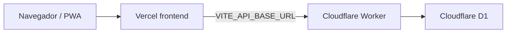

# App médica — Roadmap y estado actual

## Resumen ejecutivo

La aplicación en producción es una **app médica** desplegada sobre:

- **Frontend:** Vercel (React + Vite, modo médico por defecto).
- **Backend:** Cloudflare Worker (`geriatricos-worker-production`).
- **Base de datos:** Cloudflare D1 (`geriatricos_d1_prod`).

**Render (FastAPI + PostgreSQL) queda fuera del flujo principal.** No se migraron datos desde Render: la operación médica **reinicia desde D1 limpia** (bootstrap manual de sedes, usuarios y pacientes).

Los bloques B0–B5 (navegación médica, pacientes, clínica, indicaciones, certificados y links externos) están implementados y validados.

---

## Arquitectura actual

| Capa | Tecnología | Rol |
|------|------------|-----|
| UI | Vercel + React/Vite | Rutas médicas, hub por sede (`/g/:id/medical`) |
| API | Cloudflare Worker | Auth JWT, residents, clinical, medications, certificates |
| Datos | D1 (SQLite) | Persistencia operativa actual |

---

## Referencias técnicas (sin secretos)

| Recurso | Dónde verlo |
|---------|-------------|
| Worker production | Nombre: `geriatricos-worker-production` — [`cloudflare-worker/wrangler.toml`](../cloudflare-worker/wrangler.toml) `[env.production]` |
| URL pública del Worker | Dashboard Cloudflare → Workers → `geriatricos-worker-production` → dominio `*.workers.dev` (usar en `VITE_API_BASE_URL`) |
| D1 production | `database_name`: `geriatricos_d1_prod` — binding `DB` en `[env.production]` |
| CORS producción | `CORS_ORIGINS` en `wrangler.toml` debe incluir el origen Vercel production (ej. `https://geriatricos-proyecto.vercel.app`) |
| Frontend Vercel | Variable de entorno **`VITE_API_BASE_URL`** = URL del Worker (sin barra final); requiere **redeploy** tras cambio |
| Modo app | `VITE_APP_MODE=medical` (default) — [`frontend/.env.example`](../frontend/.env.example) |
| Links externos (B5) | `VITE_MISRX_URL`, `VITE_RECETO_URL`, `VITE_PAMI_URL` — [`frontend/src/config/medicalLinks.ts`](../frontend/src/config/medicalLinks.ts) |
| JWT production | `wrangler secret put JWT_SECRET --env production` — **no** commitear |
| Health check | `GET {WORKER_URL}/health` → `200`, `{"ok":true,"service":"geriatricos-worker"}` |
| Rutas API | [`cloudflare-worker/src/index.ts`](../cloudflare-worker/src/index.ts) |
| Superusuario inicial | Script `cloudflare-worker/scripts/create-production-superuser.mjs` (ver runbook histórico en [cutover-render-cloudflare.md](./cutover-render-cloudflare.md)) |

**Render (legacy):** el backend histórico vivía en `https://geriatricos-proyecto.onrender.com` (confirmar URL vigente en dashboard Render antes de apagar). Ya no es la API de la app médica.

---

## Alcance actual (in scope)

| Área | Descripción |
|------|-------------|
| Usuario principal | Médico (login, sede activa, hub médico por facility) |
| Pacientes | CRUD de residents bajo sede |
| Historia clínica | Resumen clínico, notas, reporte (`clinical-summary`, `clinical-notes`, `clinical-report`) |
| Evoluciones | Notas clínicas de evolución dentro del módulo clínico |
| Indicaciones | Medication plans y horarios (`medication-plans`, `medication-times`) |
| Certificados | Listado, alta y consulta de certificados |
| Accesos externos | Panel de links a MisRX, Receto, PAMI (si están configuradas las `VITE_*` en Vercel) |
| Auth mínima | Login, `/auth/me`, cambio de sede activa |
| Facilities | Listado y selección de sede |

---

## Fuera de alcance

No forman parte de la app médica actual ni del Worker de producción para este producto:

| Dominio | Notas |
|---------|--------|
| Staff | Personal, roles operativos del hogar |
| Finanzas | Transacciones, categorías, reportes OWNER |
| Turnos | Shifts |
| Asistencia | Attendance |
| Dashboard administrativo | Resúmenes owner/admin globales |
| Migración Render | Export PostgreSQL → D1 **descartada** |
| Prescription logs legacy | Flujos históricos de recetas en FastAPI |
| Admin plataforma | Impersonación, gestión masiva de usuarios |
| Agenda / activity | Calendario y actividad |
| Push / soporte / upload documentos Cloudinary | Backend Render legacy |

El directorio [`/backend`](../backend) (FastAPI) permanece en el repo como referencia histórica y desarrollo local opcional; no es el backend de producción de la app médica.

---

## Bloques completados

| Bloque | Entrega |
|--------|---------|
| **B0+B1** | Navegación médica, hub por sede, pacientes (residents) |
| **B2+B3** | Historia clínica (resumen, notas, reporte) e indicaciones (medication plans/times) |
| **B4** | Certificados |
| **B5** | Accesos externos médicos (env vars + panel en hub) |

---

## Próximos bloques posibles (no comprometidos)

- Editar / cerrar indicaciones con mejor UX de ciclo de vida.
- Búsqueda avanzada de pacientes.
- Export / backup operativo de D1.
- Links médicos configurables desde UI (sin redeploy por env).
- Impresión / export PDF más robusta en certificados e informes.

---

## Documentación relacionada

| Documento | Uso |
|-----------|-----|
| [render-shutdown-checklist.md](./render-shutdown-checklist.md) | Checklist para apagar Render |
| [cutover-render-cloudflare.md](./cutover-render-cloudflare.md) | Runbook histórico de cutover (cancelado para enfoque actual) |
| [cloudflare-worker-local-dev.md](./cloudflare-worker-local-dev.md) | Desarrollo local del Worker |
| [cloudflare-d1-local-dev.md](./cloudflare-d1-local-dev.md) | D1 local y migraciones |
| [cloudflare-worker-staging-remote.md](./cloudflare-worker-staging-remote.md) | Staging remoto |
| [cloudflare-worker-testing.md](./cloudflare-worker-testing.md) | Tests de contrato |
| [cloudflare-worker-deploy-readiness.md](./cloudflare-worker-deploy-readiness.md) | Inventario de endpoints (contexto migración completa) |
| [backend-migration-checklist.md](./backend-migration-checklist.md) | Checklist histórico migración total |
| [backend-migration-inventory.md](./backend-migration-inventory.md) | Inventario API legacy |

---

## Historial

| Fecha | Evento |
|-------|--------|
| 2026-05-28 | B6 — Documento creado; estado producción app médica en Vercel + Worker + D1 |
